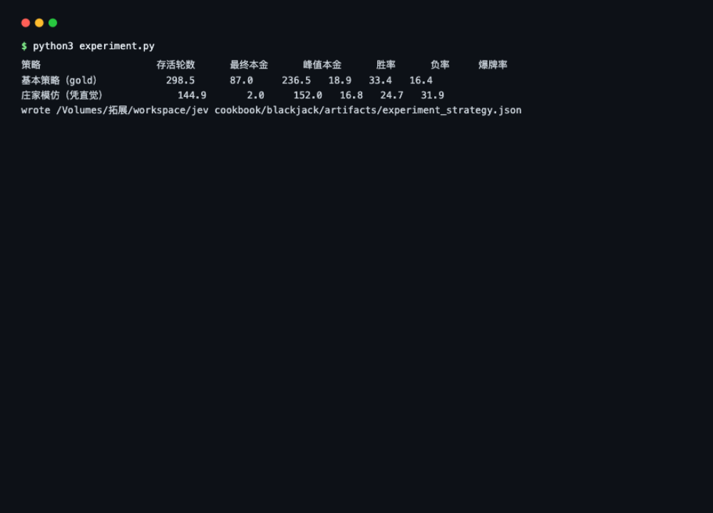
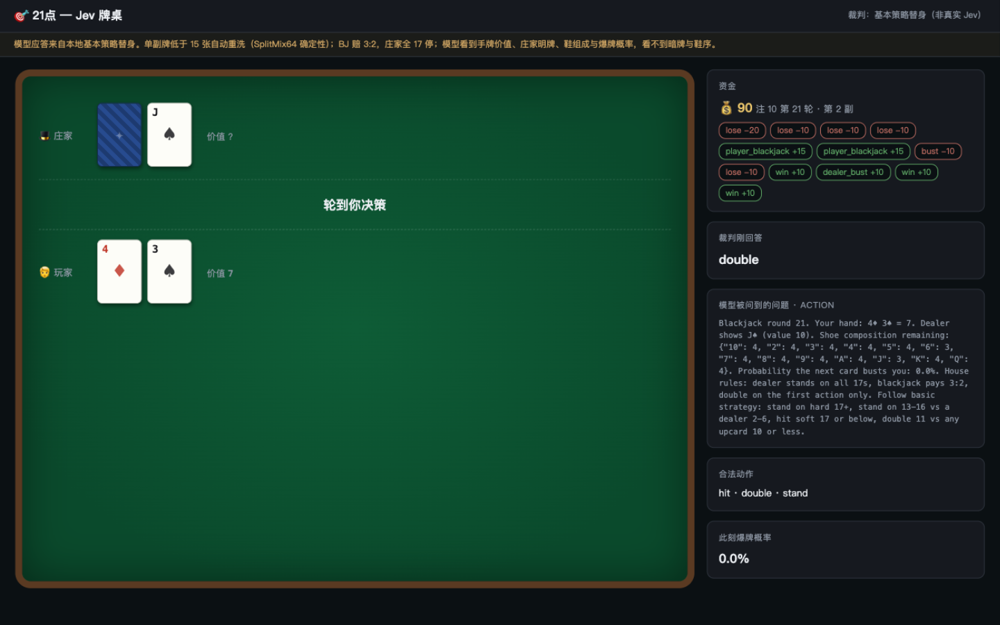

# 21点实验报告

## 1. 这是什么

一个 21 点自动对局实验：模型（或本地基本策略替身）每一手决定要牌、停牌还是
加倍，庄家按固定规则补牌，浏览器里实时看牌面和资金变化。引擎、观战服务纯
标准库，没有 API Key 也能跑。

## 2. 实验意义

21 点是很适合做实验的牌类游戏：规则完全公开（庄家 17 点必须停、黑杰克赔
3:2），而且「怎么打最好」有标准答案——基本策略表，被研究了几十年。

所以它能回答这个问题：**当我们把该算的都帮模型算好（还剩什么牌、下一张爆掉
的概率是多少），一个照基本策略打的判断者，和一个凭直觉打的判断者，长期下来
差距有多大？**

21 点还有个好处：它的标准答案是负期望——**长期必输**。所以任何策略最终都会
输光，区别只在输得多快。这样「策略好不好」就有了一个干净的衡量办法。

## 3. 要回答的问题

1. **引擎对不对**：发牌、赔率、庄家规则、加倍限制、自动洗牌，撑不撑得住几百
   轮连续对局而不出错？
2. **策略差距**：基本策略（gold）和一个普通玩家的常见打法（不到 17 就要牌、
   从不加倍），在存活时间、输光速度、爆牌率上差多少？
3. **发布事实够不够**：我们把牌堆组成、爆牌概率都算好了，一个真模型能不能
   靠这些打出基本策略水平？

## 4. 实验怎么做的

引擎 `blackjack_game.py`。两组对照，各打 10 副牌（种子相同），本金 100、
每注 10，输光或打到 400 轮停：

- **基本策略（gold）**：按硬牌/软牌 × 庄家明牌的完整表格决定要牌、停牌、
  加倍；
- **庄家模仿（凭直觉）**：普通玩家的常见打法——照抄庄家规则，不到 17 就要
  牌，从不加倍。

```bash
python3 experiment.py
```

输出：

```
策略          存活轮数   最终本金   峰值本金   胜率   负率   爆牌率
基本策略         298.5       87.0     236.5   18.9   33.4   16.4
庄家模仿         144.9        2.0     152.0   16.8   24.7   31.9
```




*图：`python3 experiment.py` 的实际运行输出——10 副牌 × 10 种子的基本策略与
庄家模仿对照。启动方式：在 `blackjack/` 目录执行 `python3 experiment.py`。*

观战页面的样子（自动连续对局中截取）：



*图：`python3 serve_blackjack.py` 启动后浏览器打开 http://127.0.0.1:8802。
庄家暗牌背面朝上，右侧面板显示资金、每手输赢历史、发给模型的问题原文
（含牌堆组成与爆牌概率）。*

观战服务实测（`serve_blackjack.py`）：决策面板里能看到完整的请求原文，包括
牌堆组成 JSON 和爆牌概率（例如 "Your hand: 9♠ J♦ = 19 … Probability the next
card busts you: 38.3%"），裁判的每次回答都能和基本策略表逐条对照。

## 5. Jev 每一步怎么工作

### 角色

每一次要牌/停牌时回答一个问题：**hit、stand 还是 double**。harness 负责算好
三件事：手牌点数（软/硬）、庄家明牌点数、**整副牌的剩余组成**和**下一张爆牌
概率**——模型不需要数牌，只需要对照策略选一个。庄家暗牌它看不到。

### 请求长什么样（真实采样，第一轮）

```json
{
  "state": "Blackjack round 1. Your hand: 8♦ 4♦ = 12. Dealer shows 9♣ (value 9). Shoe composition remaining: {\"10\": 4, \"2\": 4, …}. Probability the next card busts you: 38.3%. House rules: dealer stands on all 17s, blackjack pays 3:2, double on the first action only. …",
  "model": "jev-latest",
  "questions": {
    "action": {
      "type": "choice",
      "instructions": "Choose the action with the best expected value against the dealer upcard, using the published bust probability and hand value. Basic strategy: stand on hard 17+; stand on hard 13-16 only vs dealer 2-6; always hit soft 17 or below; double hard 11 vs upcard 2-10, hard 10 vs 2-9, hard 9 vs 3-6 when allowed.",
      "criteria": {
        "hit": "Take one card. Bust probability 38.3%; safe if the hand is soft.",
        "stand": "Keep 12 and let the dealer play. Dealer must draw to all 17s.",
        "double": "Double the bet, take exactly one more card, then stand."
      }
    }
  }
}
```

设计要点：**爆牌概率是 harness 算好直接给结论的**（38.3%），牌堆组成以 JSON
附上供模型自行推演；instructions 把基本策略写成可执行的话（「hard 13-16 只在
庄家 2-6 时停牌」），criterion 里再带本手的数字。不能加倍时，double 那条
criterion 会标注 (Not available now)。

### 回复结构（choice）

```json
{
  "answers": {
    "action": { "type": "choice", "choice": "hit", "confidence": 0.75,
                "probabilities": { "hit": 0.75, "stand": 0.2, "double": 0.05 } }
  }
}
```

gold 就是基本策略表（`basic_strategy()`）。模型分布和 gold 的偏离按庄家明牌
分桶统计，就是「偏离热力图」的数据源。

### 一次推理的运行路径

```
① 发牌/进入玩家回合（黑杰克直接结算）
② 算手牌点数（软硬）、庄家明牌、牌堆组成、爆牌概率
③ render_request 组装 state + 1 个 choice 问题（3 个动作）
④ SDK → POST；回复校验后取 answers['action'].choice
⑤ step() 执行：hit 补牌（爆则直接结算）；double 加倍并只补一张；stand 交给庄家
⑥ 庄家按规则补到 17+，结算本金、写历史记录
⑦ 回合结束自动发下一手；本金不足则 bankrupt
```

代码位置：`blackjack_game.py` 的 `render_request` / `basic_strategy` / `step`。

## 6. 实验结果与说明

### 基本策略让存活时间翻倍

基本策略平均活 298.5 轮，凭直觉打法只有 144.9 轮——**翻了一倍多一点**；本金
也是 87 vs 2。两副牌最后都归零，这符合预期：21 点长期必输，如果哪套策略长期
赚钱，那说明引擎赔率算错了。差距体现在「输得多快」上。

### 为什么差距这么大？看爆牌率

基本策略爆牌率 16.4%，凭直觉 31.9%，几乎减半。

原因很具体：凭直觉打法在「手里 12–16 点、庄家明牌很大」的局面里，还是会照
庄家规则继续要牌——明明庄家自己爆掉的概率很高，它却先把自己爆了。基本策略
在这些局面选择停牌，把风险推给庄家：庄家爆了算赢，庄家没爆本来也大概率输，
但至少不会大输。

**好策略不是赢得更多（两边胜率其实差不多，18.9% vs 16.8%），而是输得更少、
输得更小。** 这就是基本策略的核心思想。

### 对真 Jev 的预期

真 Jev 拿到的请求里，爆牌概率、牌堆组成、手牌点数全都算好了摆在眼前——它不
需要数牌，只需要按问题里写的策略对照着选。它每一次偏离基本策略的决策都会被
记下来，和最终本金曲线一对照，「判断质量值多少钱」就直接算出来了。想试：
`python3 serve_blackjack.py --judge jev`，代码零改动。

## 7. 成本与耗时

定价（官方文档，2026-09）：输入 $0.042 / 百万 token，输出免费。请求实测
1134 字节 ≈ 283 输入 token（四个实验里最小）；延迟按公开参考值 260ms/次估算
（本地替身实测 0.02ms）。

| 场景 | 决策次数 | API 耗时 | 输入 token | 费用 |
|---|---:|---:|---:|---:|
| 一手牌 | 2–6 | 0.5–1.6 秒 | 570–1700 | 约 $0.00002–0.00007 |
| 一副牌玩到破产（约 300 手） | 约 900 | 约 4 分钟（2.6–7.8） | 约 25.6 万 | 约 $0.011 |
| 本实验全部（20 副） | 约 1.8 万 | 约 1.3 小时 | 约 510 万 | 约 $0.21 |

单次最便宜，但架不住轮数多——一副牌打到底要四分钟。

## 8. 结论与后续

1. 引擎可信：10 副牌 × 数百轮连续对局，没有一次校验失败，赔付与重洗逻辑正确；
2. 基本策略的价值被清楚地量出来了：存活时间 ×2.06、爆牌率 ÷1.95，而且是在
   「长期必输」这个前提下量出来的；
3. 下一步：真 Jev 接入后，按庄家明牌分桶统计它的偏离情况，画一张「Jev 对基本
   策略的偏离热力图」。

完整数据：`artifacts/experiment_strategy.json`。
