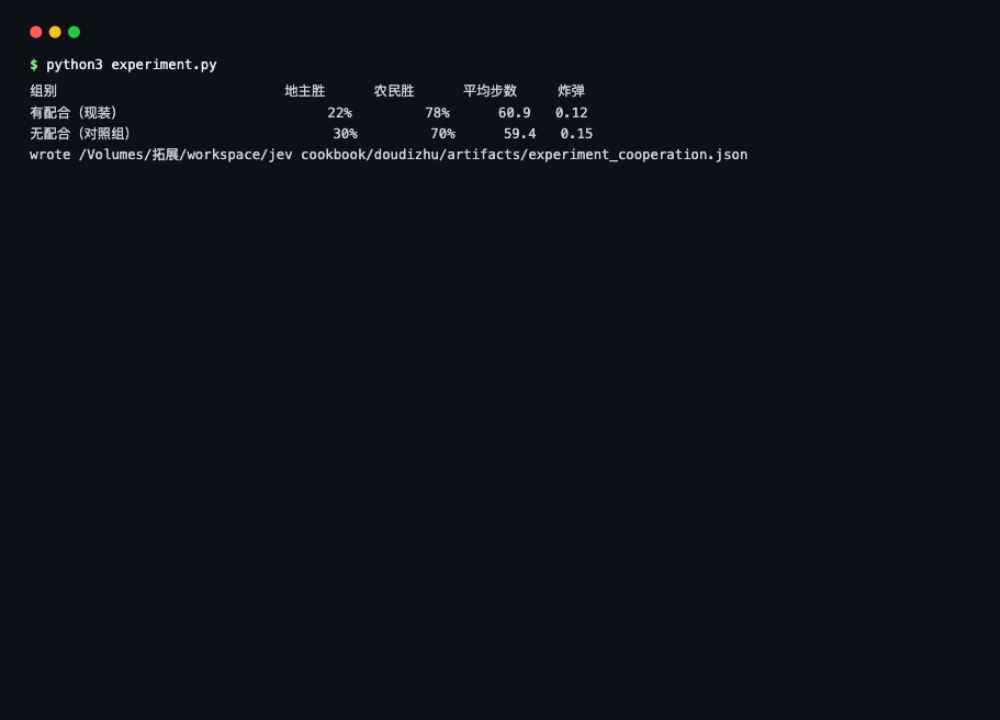
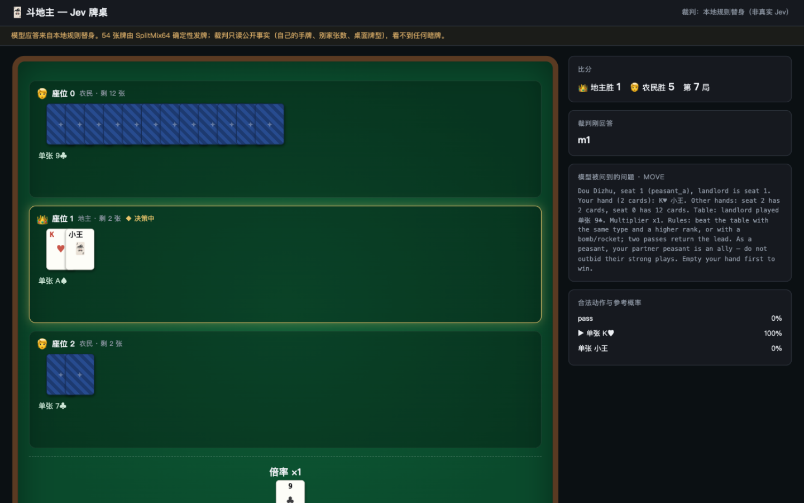

# 斗地主实验报告

## 1. 这是什么

一个斗地主自动对局实验：三家座位（一家地主、两家农民）由策略驱动连续打牌，
浏览器里可以实时看牌。本地裁判是规则策略；接真 Jev 后，每一轮出牌由模型决定。
引擎、规则、观战服务全部纯标准库，没有 API Key 也能跑。

## 2. 实验意义

数独和 21 点都是一个人做决定，斗地主不一样：**两个人一边，而且互相看不到牌**。
所以它能回答一个前面回答不了的问题——**把「团队意识」写进策略里，到底值多少？**

玩法上也更接近真实场景：两家农民共享输赢，要不要帮队友、什么时候不能抢队友
的牌，这些都是「策略知识」而不是「算术题」。上游马里奥项目的思路就是把这类
该算的东西留在代码里、把需要感觉的部分交给模型；这个实验就是量一量其中
「团队规则」这一条的贡献。

## 3. 要回答的问题

1. **基本盘**：在参考策略下，先手且多三张牌的地主，和两家人家，谁赢得多？
   引擎撑不撑得住完整对局（每步都校验 54 张牌不重不漏）？
2. **配合的价值**：策略里有一条「农民不压队友强牌」的规则（队友打出大牌、
   或队友快赢时让行）。拿掉它，农民胜率掉多少？
3. **可玩性**：出牌节奏、炸弹/倍率出现频率，撑不撑得起一个有意思的观战页面？

## 4. 实验怎么做的

引擎 `doudizhu_game.py`：SplitMix64 确定性发牌（同种子发同一副牌）、10 种
牌型（单张/对子/三张/三带一/三带二/顺子/连对/飞机/炸弹/王炸）、完整压制
规则，每走一步做 54 张牌的分区校验。

参考策略：领出时先卸大组合；跟牌时用刚好压得住的最小牌；炸弹只在危险时刻
用（对手只剩两张牌以内，或桌面牌到 A）。

两组对照，同样 40 个种子各打 40 局：

- **有配合（现装版本）**：农民按上面的规则办事；
- **无配合（对照组）**：其他一模一样，只拿掉「队友的牌不打」这条规则——
  农民把队友也当对手，见大就压。

```bash
python3 experiment.py
```

输出：

```
组别                    地主胜   农民胜   平均步数   平均炸弹数
有配合（现装）            22%      78%      60.9       0.12
无配合（对照组）           30%      70%      59.4       0.15
```



*图：`python3 experiment.py` 的实际运行输出——同种子 40 局的有配合/无配合对照。
启动方式：在 `doudizhu/` 目录执行 `python3 experiment.py`。*

观战页面的样子（自动连续对局中截取）：



*图：`python3 serve_doudizhu.py` 启动后浏览器打开 http://127.0.0.1:8801。
金色边框是正在决策的座位，👑 是地主；右侧面板实时显示发给模型的问题全文、
全部候选动作与参考概率、裁判刚给出的选择。*

观战服务实测（`serve_doudizhu.py`）：连续自动对局中能看到完整的「领出 → 压制
→ 两家 pass 后回到领出者」循环，三带二、顺子、连对自然出现，炸弹翻倍时触发
震屏特效。

## 5. Jev 每一步怎么工作

### 角色

每一轮回答一个问题：**从全部合法出牌里选一个**（一局大约 60 轮，每轮 40–60
个候选）。哪些牌合法、哪些能压过桌面、谁是队友，全是 harness 算的；模型只做
选择。**它看不到另外两家的手牌**——请求里只有别家剩几张，和人类玩家一样。

### 请求长什么样（真实采样）

```json
{
  "state": "Dou Dizhu, seat 1 (peasant_a), landlord is seat 0. Your hand (17 cards): 3♠ 4♥ 5♦ … Table: landlord played 对子 5♠ 5♥. Multiplier x1. Rules: beat the table with the same type and a higher rank, or with a bomb/rocket; two passes return the lead. As a peasant, your partner peasant is an ally — do not outbid their strong plays. …",
  "model": "jev-latest",
  "questions": {
    "move": {
      "type": "choice",
      "instructions": "Choose the single best play. Lead by unloading large combinations first and saving singles; follow by beating with the smallest sufficient play. As a peasant, never outbid your partner peasant when their play is already strong (rank >= J) or when they are within a few cards of winning. Save bombs and the rocket for when the landlord is within two cards of winning or the table rank is A or higher. …",
      "criteria": {
        "m0": "Pass this turn.",
        "m1": "Play 对子 3♠ 3♦; leaves 18 cards in hand.",
        "m2": "Play 对子 5♠ 5♥; leaves 18 cards in hand.",
        "…": "共 56 个候选（本局实测），每个带「出完剩几张」"
      }
    }
  }
}
```

设计要点：**候选数量随局势膨胀**（56 个是实测值），所以 instructions 把策略
写全（领出/跟牌/队友/炸弹四个维度），criterion 只带最关键的当场后果。
标准答案（代码里叫 gold）分两层：每个动作「是否压得过桌面」是程序能判定的
对错；参考策略推荐只是「一个合理打法」，不是最优解（数据里标注了
not a game-theoretic optimum）。

### 回复结构（choice）

```json
{
  "answers": {
    "move": { "type": "choice", "choice": "m2", "confidence": 0.7,
              "probabilities": { "m0": 0.1, "m1": 0.2, "m2": 0.7 } }
  }
}
```

模型只看到 `m2` 这种 id 和文字说明，id 和实际出牌的对应关系由 harness 处理。

### 一次推理的运行路径

```
① 轮到某座位（地主先出；两家 pass 后回到领出者）
② gen_moves() 枚举该座位全部合法动作（领出=全部，跟牌=能压的+pass）
③ render_request 组装：自己的牌、别家剩牌、桌面牌型、倍率 + 1 个 choice
④ SDK → POST；取 answers['move'].choice 映射回动作
⑤ step()：出牌则更新桌面/扣牌/炸弹翻倍；pass 则计数，两家 pass 清桌面
⑥ 手牌空 → 该方胜；记录 history 与 multiplier
```

代码位置：`doudizhu_game.py` 的 `gen_moves` / `render_request` / `make_record` / `step`。

## 6. 实验结果与说明

### 基本盘：农民明显占优（78%）

地主虽然先出牌、还多拿三张底牌，但「两家农民共享输赢」这个结构本身更有利——
一家出错另一家能兜。参考策略没有博弈论意义上的最优性，但 22% vs 78% 说明
两边都有赢面，牌局有来有回，适合观战。

### 「队友的牌不打」这一条值 8 个百分点

拿掉这条规则，农民胜率从 78% 掉到 70%，地主胜率相应从 22% 涨到 30%。

为什么？不配合的时候，农民会用大牌去压队友的小牌。这做了两件坏事：火力本
可以对着地主，结果消耗在队友身上；而且让地主多获得一次出牌机会。

**8 个百分点就是这一条团队规则的净贡献。** 这种「一条规则值多少胜率」的量法
很有用——以后给模型写策略时，每条规则单独 A/B 一下，就知道哪些知识真的在
起作用。

### 对真 Jev 的预期

真 Jev 拿到的信息和本地裁判完全一样（自己的牌、别家剩几张、桌面出什么），
问题文本里也明确写了「队友的牌不要压」这条策略。它到底听不听、什么时候该
不听（比如自己快赢了该抢牌），恰好是这套环境能直接看出来的行为——
`make_record` 的 gold 就是按配合版策略算的，偏离了多少一算就知道。

## 7. 成本与耗时

定价（官方文档，2026-09）：输入 $0.042 / 百万 token，输出免费。请求实测
6537 字节 ≈ 1634 输入 token（56 个候选动作逐个写成说明）；延迟按公开参考值
260ms/次估算（本地替身实测 0.02ms）。

| 场景 | 出牌次数 | API 耗时 | 输入 token | 费用 |
|---|---:|---:|---:|---:|
| 一局 | 约 60 | 约 16 秒 | 9.8 万 | 约 $0.0041 |
| 本实验全部（80 局） | 约 4800 | 约 21 分钟 | 78 万 | 约 $0.33 |

请求大是因为每轮要把 50+ 个候选动作逐个写成说明文字。如果嫌贵，可以把候选
裁到「前 12 个 + 一个其他」再让模型选。

## 8. 结论与后续

1. 引擎完整可用：80 局自动对局全部通过校验，牌型、压制、胜负判定都正常；
2. 团队规则可以逐条定价：配合规则值 8 个百分点农民胜率；
3. 下一步：用 `--judge jev` 跑真模型，统计它「违反配合规则的频率 × 局势」，
   就能看出它的团队意识有多少。

完整数据：`artifacts/experiment_cooperation.json`。
