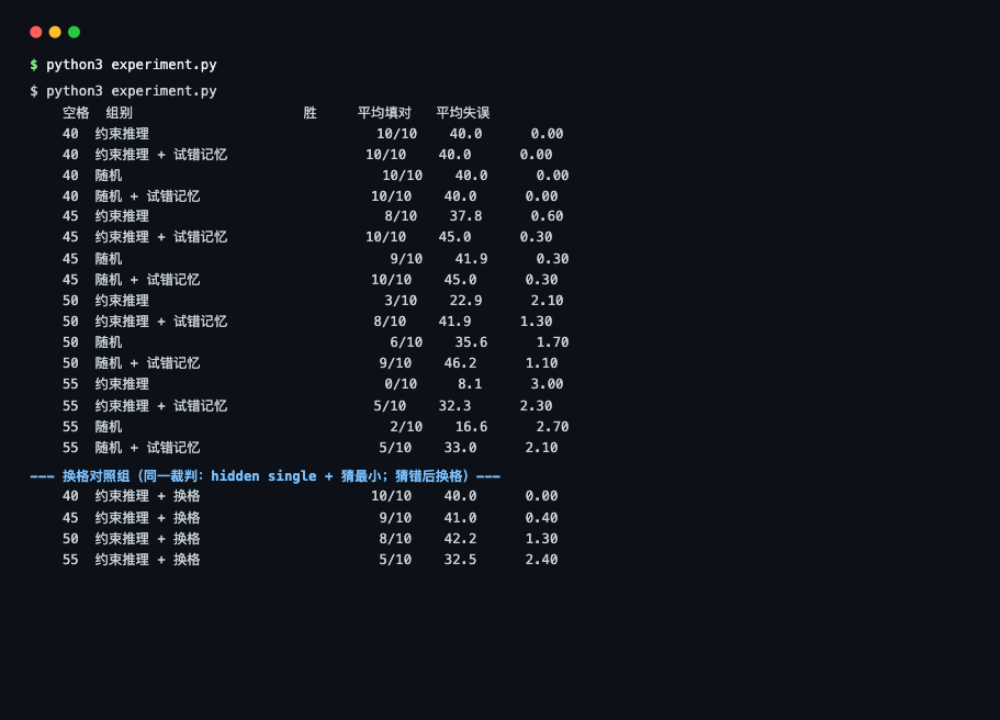

# 数独实验报告

## 1. 这是什么

一个数独解题实验：harness 负责选格子、整理约束事实，Jev 每一步只回答一个问题——
**这个空格填 1 到 9 哪个数字**。填错记一次失误，错满三次本局结束；把所有空格
填对即胜。引擎、评测、本地裁判全部纯标准库，没有 API Key 也能跑。

## 2. 实验意义

数独是观察「模型做判断」最干净的小游戏：每一步只做一个简单选择，答案有唯一
解（谜题只有一个正确版本，用程序就能判定对错），而且**喂给模型的材料完全由我们
控制**——发布哪些事实、用什么形式发布，都是实验变量。

所以它能回答一个核心问题：**我们把事实准备得越清楚，模型是不是就能做得越好？**
这也是 JevHarness 那套方法论（算术留在代码、判断交给模型）最基础的检验台：
没有物理引擎噪声、没有延迟耦合，错一步就能立刻归因到具体某个决策。

## 3. 要回答的问题

1. 空格数量能不能当难度旋钮用？40 个空格和 55 个空格之间有没有拉开可测量的差距？
2. 一个会读约束条件做推理的裁判，是否比一个拿到同样材料但只是瞎蒙的裁判强？
3. 约束推理什么时候不够用？不够用的时候，失败以什么形式出现？
4. 失败的修法有几种？「记住猜错的数字」和「猜错就换一个格子」哪种更好？

## 4. 实验怎么做的

**环境**：`sudoku_game.py`——SplitMix64 确定性生成（同种子同谜题）、唯一解
校验（每挖一个洞都验证解仍然唯一）、MRV 选格（每一步挑剩余可能最少的空格，
这是 harness 的预计算，不是模型的活）。

**四组对照 = 两个裁判 × 有无试错记忆**。两个裁判都看不到答案，只能看发布
出来的棋盘和候选数字：

- **约束推理裁判**：先找「只剩一种可能」的格子（naked single），再找「某个
  数字在本行/本列/本宫里只能放这里」的（hidden single），都没有就猜；
- **随机裁判**：拿同一份候选数字随机挑（种子固定，结果可复现）。

**试错记忆**（第二轮加入）：runner 记录每格已猜错的数字，在下一拍把
「Digits already tried and proven wrong at this cell: 1, 2. Do not repeat them.」
写进状态文本、同时以 `wrong_digits` 字段发布。裁判的兜底猜测会排除这些
已证错的数字——就像人类玩家看到铅笔标记划掉了一个数。没有记忆时，确定性
裁判会在同一格上反复猜同一个错答案，3 次机会全部浪费。

**网格**：空格数 {40, 45, 50, 55} × 每格 10 局 × 4 组。

```bash
python3 experiment.py
```

输出：

```
空格数 组别                                 胜   平均填对   平均失误
   40 约束推理                             10/10      40.0          0.00
   40 约束推理 + 试错记忆                  10/10      40.0          0.00
   40 随机                                 10/10      40.0          0.00
   40 随机 + 试错记忆                      10/10      40.0          0.00
   45 约束推理                              8/10      37.8          0.60
   45 约束推理 + 试错记忆                  10/10      45.0          0.30
   45 随机                                  9/10      41.9          0.30
   45 随机 + 试错记忆                      10/10      45.0          0.30
   50 约束推理                              3/10      22.9          2.10
   50 约束推理 + 试错记忆                   8/10      41.9          1.30
   50 随机                                  6/10      35.6          1.70
   50 随机 + 试错记忆                       9/10      46.2          1.10
   55 约束推理                              0/10       8.1          3.00
   55 约束推理 + 试错记忆                   5/10      32.3          2.30
   55 随机                                  2/10      16.6          2.70
   55 随机 + 试错记忆                       5/10      33.0          2.10
```



*图：`python3 experiment.py` 的实际运行输出——四组对照（约束推理/随机 × 有无
试错记忆）在 4 个难度下的完整成绩，以及换格对照组。启动方式：在 `sudoku/`
目录执行 `python3 experiment.py`（纯标准库，无需安装任何东西）。*

## 5. Jev 每一步怎么工作

### 角色

每一步只回答一个问题：这个格子填哪个数字。选格子、整理排除理由都是 harness
干的。真跑时（`--judge jev`），一次请求里还会附带 9 个判断题（每个数字一个：
「填这里是否与唯一解一致」），用来和模型的回答做对照（代码里把这组标准答案叫 gold）——同一个请求一次往返全拿回。

### 请求长什么样（真实采样，seed=7）

```json
{
  "state": "Sudoku 9x9, zero-based (row,column). Dots are empty cells.\n3 5 1 2 7 6 . . 8   <- next cell (row 0, column 7)\n. . . 8 . . 3 5 .\n…",
  "model": "jev-latest",
  "questions": {
    "digit": {
      "type": "choice",
      "instructions": "Write exactly one digit into the named cell. Use the published row/column/box exclusions first …",
      "criteria": {
        "1": "Write 1 at (row 0, column 7). IMPOSSIBLE: it already appears in row 0.",
        "2": "Write 2 at (row 0, column 7). IMPOSSIBLE: it already appears in row 0.",
        "4": "Write 4 at (row 0, column 7). survives all three row/column/box checks.",
        "…": "共 9 个候选数字，每个带本格的排除理由"
      }
    },
    "fits_4": {
      "type": "boolean",
      "instructions": "If the cell (row 0, column 7) is filled with 4, is that the digit the puzzle's unique solution places there?"
    }
  }
}
```

注意 criterion 的写法：**排除理由直接写在选项里**（「IMPOSSIBLE: it already
appears in row 0」），模型不用自己扫行列宫；被禁填的数字也保留为选项并标明
不可能——这样从概率分布里能看出它对错误选项留了多少余地，这本身就是信息。

### 回复结构（choice）

```json
{
  "answers": {
    "digit": { "type": "choice", "choice": "4", "confidence": 0.9,
               "probabilities": { "1": 0.02, "4": 0.9, "…": 0.08 } },
    "fits_4": { "type": "noul", "noul": 0.97 }
  }
}
```

`choice` 字段就是答案；`probabilities` 可画成概率条；9 个 `fits_N` 的 noul 值和标准答案逐个对照，就能看出它在哪些数字上犹豫、犹豫多少。

### 一次推理的运行路径

```
① MRV 从当前棋盘挑出约束最多的空格
② 算该格的行/列/宫已用数字，生成候选
③ render_request 组装棋盘文本 + 10 个问题（1 choice + 9 boolean）
④ SDK 序列化 → POST /v1/systemone
⑤ 回复校验 → 取 answers['digit'].choice
⑥ step()：对则填盘并 score+1，错则 mistakes+1（错误不入盘）
⑦ 棋盘全满 → win；mistakes 到 3 → three_mistakes
```

代码位置：`sudoku_game.py` 的 `render_request` / `make_record` / `step`。

## 6. 实验结果与说明

### 难度旋钮有效

40 个空格四组全胜；55 个空格都很难。45–55 是有区分度的区间：空格少时 MRV
选出的格子通常只剩一种可能，闭着眼不会错；空格多了就要靠真正的搜索推理，
错满三次就出局。

### 第一轮发现：推理裁判输给了随机裁判（都关掉记忆时）

不看试错记忆时两组对比：45 空格随机 9 胜 vs 推理 8 胜；55 空格随机 2 胜 vs
推理 **0 胜**。推理裁判为什么会输给瞎蒙的？

原因不在推理，在兜底：hidden single 永远不会错，但当它覆盖不到时，推理裁判
的兜底是**每次都猜最小的数字**。猜错后该格不落盘，下一轮 MRV 还是选同一格，
它还是猜同一个错答案——3 次机会全耗在一格上。随机裁判会换着数字试，反而
有命中机会。

### 修复：试错记忆带来全面大幅提升

给 runner 加上试错记忆后（错误不入盘，但每格的错答案会被记住并发布回请求），
两个裁判同时改善：

| 空格 | 裁判 | 无记忆 | 有记忆 | 提升 |
|---:|---|---:|---:|---|
| 45 | 约束推理 | 8/10 | **10/10** | 全胜 |
| 45 | 随机 | 9/10 | **10/10** | 全胜 |
| 50 | 约束推理 | 3/10 | **8/10** | +167% |
| 50 | 随机 | 6/10 | **9/10** | +50% |
| 55 | 约束推理 | 0/10 | **5/10** | 从全败到过半 |
| 55 | 随机 | 2/10 | **5/10** | 平均填对 16.6 → 33.0（翻倍） |

最有说服力的是约束推理裁判在 55 空格的曲线：**0/10 → 5/10**。推理本身没变
（hidden single 还是那些），变的只是「猜错之后不再重复」。一条信息的发布方式
改动，把一个全败的裁判拉回到有胜率。

### 修复之后：推理与随机的差距被记忆抹平了？

有意思的后续观察：加了记忆之后，随机裁判在 50 空格反而以 9/10 微胜推理裁判
的 8/10（55 空格两者打平 5/10）。解释：记忆给了随机裁判「换着试」的系统性
优势后，3 次机会几乎把候选数字试了个遍；而推理裁判的 hidden single 优势主要
在 40–45 空格的简单局面（那里它 10/10 全胜且零失误）。到 55 空格，两个裁判
剩下要解决的都是「3 次预算内的真搜索」，差距归零。

这正是给真 Jev 留下的位置：**记忆抹平了兜底差异之后，还能继续拉开差距的，
只有真正的推理深度。**

### 第三种修法：猜错就换格（与试错记忆效果持平）

试错记忆之外还有一条路：**不改变猜什么，改变在哪里猜**——某格猜错后把它
「搁置」（MRV 跳过它），先去别的格子推进；当别的正确填写把搁置格的候选压缩到
唯一时，再回来免费拿分。换格对照组实测：

```
空格数  换格策略   胜     平均填对   平均失误
   45   换格       9/10      41.0       0.40
   50   换格       8/10      42.2       1.30
   55   换格       5/10      32.5       2.40
```

与试错记忆几乎持平（45 洞 9 vs 10，50/55 洞打平）。这不难理解：两个修法破的是
**同一个死锁**——「同一状态 → 同一选择 → 同一错误」的循环。记忆靠横向消除
（每个错误永久划掉一个候选），换格靠纵向搁置（把拿不准的格子停牌，等别的
进展把它变成必得分）。三条路放在一起看：

| 修法 | 45 洞 | 50 洞 | 55 洞 | 机制 |
|---|---:|---:|---:|---|
| 现装（原地循环） | 8/10 | 3/10 | 0/10 | 同一错答案重复三次，预算全废 |
| 试错记忆 | 10/10 | 8/10 | 5/10 | 错误变排除，每次失误都在缩小范围 |
| 猜错换格 | 9/10 | 8/10 | 5/10 | 错误变搁置，用别的进展间接约束 |

55 空格三者都到不了 8/10 以上：剩下的失败是「3 次错误预算内排除不完的真搜索」，
不允许反悔重来的策略到这里就到头了。

### 对真 Jev 的预期

真 Jev 拿到的材料和本地裁判一样（棋盘、候选、已证错数字），它的兜底不是
`cands[0]`。想试直接 `python3 jev_sudoku.py --judge jev --trial-memory`，
代码零改动；推荐从 50–55 空格档位开始测。

## 7. 成本与耗时

定价（官方文档，2026-09）：输入 $0.042 / 百万 token，输出免费。请求实测
4774 字节 ≈ 1193 输入 token；延迟按公开参考值 260ms/次估算（本地替身实测
0.02ms）。

| 场景 | 决策次数 | API 耗时 | 输入 token | 费用 |
|---|---:|---:|---:|---:|
| 一局（40 空格） | 40 | 约 10 秒 | 4.8 万 | 约 $0.0020 |
| 一局（55 空格） | 55 | 约 14 秒 | 6.6 万 | 约 $0.0028 |
| 本实验全部（80 局） | 3200–4400 | 14–19 分钟 | 38–52 万 | 约 $0.016–0.022 |

数独是四个实验里最便宜的：盘子小、决策快、一局十几秒。

## 8. 结论与后续

1. 空格数量是个好用的难度旋钮，推荐 50–55 区间做评测档位（45 及以下加记忆
   后已近全胜，区分度不足）；
2. **破除死锁的两种修法等价且都大幅有效**：试错记忆（55 空格 0/10 → 5/10）
   与猜错换格（0/10 → 5/10）效果持平——它们破的是同一个「同一状态 → 同一
   选择 → 同一错误」循环。发什么事实、怎么发，和模型多聪明同样重要；
3. 记忆抹平兜底差距后，50–55 区间剩下的正是真搜索难题——真 Jev 接入后
   （`python3 jev_sudoku.py --judge jev --trial-memory`），在这里的表现就是它
   推理深度的直接读数。

完整数据：`artifacts/experiment_difficulty.json`。
