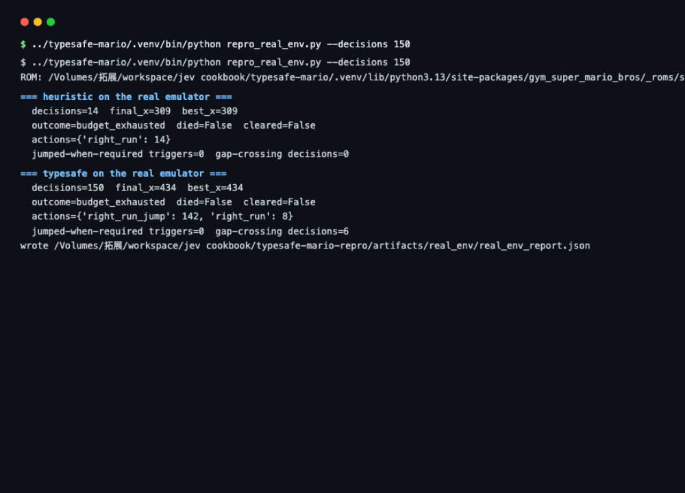

# 马里奥复现实验报告

> 这是结构版。完整的逐帧取证、所有踩过的坑和错误更正记录在
> [REPORT.md](REPORT.md)，想看细节去那边。

## 1. 这是什么

上游项目 [typesafe-mario](https://github.com/fhshaik/typesafe-mario) 做的事是：
让 Jev 直接玩《超级马力欧兄弟》，但**不给它看画面**——只给它一堆从游戏内存里
读出来的数字（马力欧在哪、跑多快、前面有什么怪、地形什么样）。核心想法是：
**该算的代码算好，只让模型做判断。**

这个复现实验把整套东西搬到真机上跑起来（`gym-super-mario-bros` 自带的 ROM），
验证这个想法行不行，并找出它在哪里不行。

## 2. 实验意义

这是四个实验里唯一一个「实时系统 + 不完美信息 + 物理引擎」的环境。数独、
21 点、斗地主验证的是「事实质量 → 判断质量」；马里奥在这之上还压上两个
真实工程问题：**推理延迟**（模型想好了世界已经翻篇）和**输入执行**（模型选了
动作，模拟器不一定照做）。上游 README 声称"没有任何脚本化的兜底动作"——
复现就是要把这句话放到真机上检验。

## 3. 要回答的问题

| # | 问题 |
|---|---|
| A | 上游代码在真游戏上能原样跑通吗？ |
| B | 上游代码里有没有让模型「有力使不出」的毛病？ |
| C | 模型看到的地形传感器（碰撞网格）靠得住吗？ |
| D | 把事实准备得更好（学 JevHarness 的做法），模型能玩得更好吗？ |

## 4. 实验怎么做的

真游戏、真 2KB 内存、上游代码一行没改，只把「问模型」这一步换成本地替身
（机器上没有 API Key）。替身按真实 wire 格式应答，序列化、校验、答案提取走的
都是同一条代码路径。

### A. 真机跑通 + 发现按键问题

`ruff` 和 10 个单元测试全过；真内存读出来的网格、地形数据都是对的。

但发现一个毛病：**`--display none`（无窗口模式）下，模型连按跳跃键跳不起来。**
原来超级马力欧的规则是「松开再按下 A 才算一次新跳跃」——可视化窗口模式处理
了这件事，无窗口模式忘了。结果模型对着墙连下 269 次「起跳」命令，**一次都没
跳起来**，活活卡死在墙前。同一策略、同一副牌，把按键问题修掉之后，从 x=594
（水管前）一路打到 x=1124：

```
真机 A/B（ab_real_env.py，同 ROM 同策略同种子）：
variant                   max_x  decisions_at_max_x  release_frames
baseline (as shipped)       594                 369               0
with release edge          1124                   1               5
```

### B. 你发现的「网格里没有坑」

分享页面上有人注意到：模型看到的碰撞网格里没有坑，但它一直死在那。查下来是
个更严重的问题：

模型读地形的方式有个错位——游戏的地形数据是跟着镜头滚动的，而上游代码按关卡
绝对坐标去读。**镜头位置凑巧时读对，不凑巧时整整错开一页**（256 像素）。错开
的时候模型看到的网格是一片空白：没有坑、没有地面、什么都没有。

也就是说，模型大约一半的时间是「瞎的」。它每次走到那个坑边，看到的情报都是
「前方一路畅通」，然后径直掉下去——这就是「一直死在这里」的真正原因。

修法（在我们这层包一层，上游没动）：按镜头位置重新读一遍。修完之后，死亡
分布从「全部堆在一个坑」变成 `[843×4, 1149, 1416]`——有一局越过了从来没能
通过的 1104 大坑。

### C. 决策节奏才是第一约束

实测出跳跃的完整数据：跑跳最高 68 像素、滞空 47 帧、水平跨度 82 像素。
World 1-1 第一根 4 格高的水管，**允许起跳的位置只有 28.6 像素宽**。而上游
默认 8 帧才做一次决定——一拍就跨过 21 像素，经常整拍错过窗口。

把决定频率调到 4 帧一次，同一个策略最好成绩从 1124 变成 **3156**（2.8 倍）。
**这是本次研究对上游最实用的一条建议。**



*图：`../typesafe-mario/.venv/bin/python repro_real_env.py --decisions 150` 的实际
运行输出——真 ROM 上两个策略各跑一局（ROM 路径、每局决策数、最远距离、动作分布
落盘到 artifacts/real_env/）。环境准备：在上游 `typesafe-mario/` 目录执行
`uv venv --python 3.13 .venv` + `pip install -e ".[mario,dev]"`。

观战页面的样子（真实模拟器自动对局中截取）：


*图：`../typesafe-mario/.venv/bin/python viz_server.py` 启动后浏览器打开
http://127.0.0.1:8770。左侧是真 NES 画面与已探明的关卡地图，右侧是模型看到的
全部信息：三种回复原语各占一块（choice 概率条、noul 前跳判断、score 危险度），
外加置信度、推理延迟与帧率控制。*

### D. 学 JevHarness 重写信息层（负结果）

按 JevHarness 的三板斧重写了一遍信息层（`mario_harness_v2.py`）：把「能不能
跳过这个坑」提前算成一句话结论、每个动作的说明里带上当场的具体数字、把前几次
死亡蒸馏成教训注入下一次决策。真机 A/B 的结果：**没打过原版**
（900/1517 vs 1124/3156）。

为什么？本地替身是规则程序，它不读我们精心写的文字——六局的行为逐字节一样，
说明那些改进它一点没吸收。而原版的粗糙策略（3 格内就跳）在 4 帧粒度下歪打正
着，变成「高频连跳」，对连续水管段反而好用。

**这个负结果不是说「把事实准备好」没用，而是说：规则替身测不出这件事。**
要验证这个说法，必须上真 Jev（设个环境变量就行，代码零改动）。

## 5. Jev 每一步怎么工作

### 角色

每一拍（4–8 帧游戏画面）回答**三个问题**（共享同一份 state，一次往返）：

1. `next_action`（choice，7 个手柄宏）——下一步按什么；
2. `jump_needed`（noul）——此刻前跳有没有用；
3. `danger`（score，0–2）——处境多危险，供页面可视化。

它**不执行任何动作**：选完由模拟器推进，下一拍的事实重新解析再问。

### 请求长什么样（真实报文，存档在 artifacts/sample_request.json）

```json
{
  "state": {
    "objective": "Reach the flag in World 1-1 without dying.",
    "player": { "x": 172, "y": 79, "grounded": true, "jump_phase": "grounded" },
    "trajectory": { "airborne_frames": 0, "crossing_known_gap": false },
    "hazard": { "enemy_ahead": true, "nearest_enemy_kind": "goomba",
                "nearest_enemy_distance_pixels": 42,
                "jump_must_start_this_decision": false },
    "terrain": { "obstacle_distance_tiles": null, "gap_distance_tiles": 6,
                 "observation_reliability": "high" },
    "reaction_timing": { "action_horizon_frames": 8, "last_inference_delay_frames": 0 },
    "recent_control": { "action": "right", "frames_observed": 1, "outcome": "not_enough_evidence" },
    "episode": { "lives": 2, "time_left": 387, "progress": 172, "stalled_frames": 0 }
  },
  "model": "jev-latest",
  "questions": {
    "next_action": { "type": "choice",
      "instructions": "Which controller macro should Mario commit to next? …（8 组策略）",
      "criteria": { "noop": "Release the controls …", "right_run_jump": "Start a running jump when terrain or projected contact requires it …", "…": "共 7 个" } },
    "jump_needed": { "type": "noul",
      "instructions": "Do trusted terrain, projected hazard, trajectory … indicate that a forward jump should begin or remain held now?" },
    "danger": { "type": "score",
      "instructions": "How dangerous is Mario's immediate situation?",
      "criteria": ["Safe open movement", "Potential obstacle or enemy soon", "Immediate collision, fall, or enemy threat"] }
  }
}
```

v2 harness 在此之上加两个键：`takeoff_window`（起跳窗口判定，jump_now / wait /
too_late / regain_speed 四态）和 `prior_attempts`（跨局死亡蒸馏出的教训）。

### 回复结构（真实报文，存档在 artifacts/sample_response.json）

```json
{
  "model": "jev-latest",
  "usage": { "input_tokens": 1932, "output_tokens": 12 },
  "answers": {
    "next_action": { "type": "choice", "choice": "right_run", "confidence": 0.88,
                     "probabilities": { "noop": 0.02, "right_run": 0.88, "…": 0.14 } },
    "jump_needed": { "type": "noul", "noul": 0.05 },
    "danger": { "type": "score", "score": 0.0, "confidence": 0.85,
                "legend": { "0": "Safe open movement", "1": "Potential obstacle or enemy soon", "2": "Immediate collision …" },
                "probabilities": { "0": 0.9, "1": 0.08, "2": 0.02 } }
  }
}
```

（样例由本地替身按同一 schema 生成；真 API 的字段结构一致。）三种原语在这里
同时出现，各司其职：choice 驱动动作，noul 上页面「前跳是否有利」条，score 上
「即时危险度」条。

### 一次推理的运行路径

```
① 模拟器推进 frames_per_decision 帧
② _unwrap_ram() 从层层包装里取出 2KB RAM
③ MarioStateParser 解析：敌人槽位、nametable 地形、位置/速度、上回合结果
   （parser_fix.py 在复现层修正相机页错位，即实验 B）
④ （v2）feasibility_features 算起跳窗口；AttemptMemory 蒸馏跨局教训
⑤ policy.choose() 构造 Choice/Noul/Score 三个问题对象
⑥ TypeSafeClient.system_one(state, questions) → POST /v1/systemone
⑦ SDK 用 Pydantic wire model 校验；_answer() 从 choices/nouls/scores 取回
⑧ Decision(action, confidence, probabilities, latency_ms, jump_needed, danger)
⑨ runner 把 action 映射到 SIMPLE_MOVEMENT 索引；dashboard 路径按需插入
   JUMP_RELEASE_ACTION 释放帧（实验 A 的那个修正），然后 env.step() 推进
```

代码位置：上游 `typesafe_mario/policy.py`（choose/_answer）、
`typesafe_mario/runner.py`（循环与释放帧）；复现层 `repro_run.py`（替身与客户端
补丁）、`mario_harness_v2.py`（v2 harness）、`parser_fix.py`（传感器修正）。

## 6. 实验结果与说明

四个实验连起来是一个完整的故事：

**上游的思路是对的，但有两处实现 bug（按键抬起沿、地形相机页），让模型大约
一半的时间处于「下了命令没人执行 + 眼睛基本失明」的状态。** 在这种状态下谈
任何模型侧优化都没意义——先把这两处修好，模型的实际表现才有可能接近它的
设计上限。

| 发现 | 影响 |
|---|---|
| 无窗口模式缺按键抬起沿：同一策略 594 卡死（269 拍原地、269 次下令起跳未起跳）vs 修好后 1124 | 模型的指令未被输入层执行，且状态里没有任何字段告知模型——「指令被忽略」对模型不可见 |
| 地形相机页错位：⌊camera/256⌋ 为奇数时主障碍传感器全盲（约占一半位置） | 解释全部「反复死在同一坑」记录；修复后死亡分布打散、出现 1416 新纪录 |
| 决策频率 8→4 帧使 best_x ×2.8（1124→3156） | 对上游最有价值的单条优化建议 |
| 精细化事实发布未胜过粗糙启发式（900/1517 vs 1124/3156） | 替身不读文本；「事实准备得好不好，决定模型表现好不好」必须由真 Jev 来验证 |

## 7. 成本与耗时

定价（官方文档，2026-09）：输入 $0.042 / 百万 token，输出免费。请求实测
v1 4653 字节 ≈ 1163 token，v2 5698 字节 ≈ 1424 token（多起跳窗口判定与跨局
记忆，+22%）；延迟按公开参考值 260ms/次估算（本地替身实测 0.02ms）。

| 场景 | 决策次数 | API 耗时 | 输入 token（v1） | 费用（v1） |
|---|---:|---:|---:|---:|
| 早死局（撞第一根水管） | 68 | 约 18 秒 | 7.9 万 | 约 $0.0033 |
| 长局（过第一根水管） | 317 | 约 82 秒 | 36.9 万 | 约 $0.0155 |
| 本实验累计（约 100 局） | 约 1.5 万 | 约 1 小时 | 约 1750 万 | 约 $0.73 |

四个实验里最贵的：一局动辄 300 拍（4 帧一拍），且请求带着完整地形和前方敌人的预测位置。
省钱办法是调大 `--frames-per-decision`（拍数变少，但错过起跳窗口的概率上升）。

## 8. 结论与后续

1. 上游思路成立（真机全链路跑通），但有两处真实缺陷，都已用 A/B 量化影响；
2. 决策频率 8→4 帧是单点收益最大的优化（2.8 倍）；
3. 信息层重写的价值本地测不出，是真 Jev 接入后的第一件事；
4. 建议把按键抬起沿、地形相机页两处修复反馈给上游作者。
